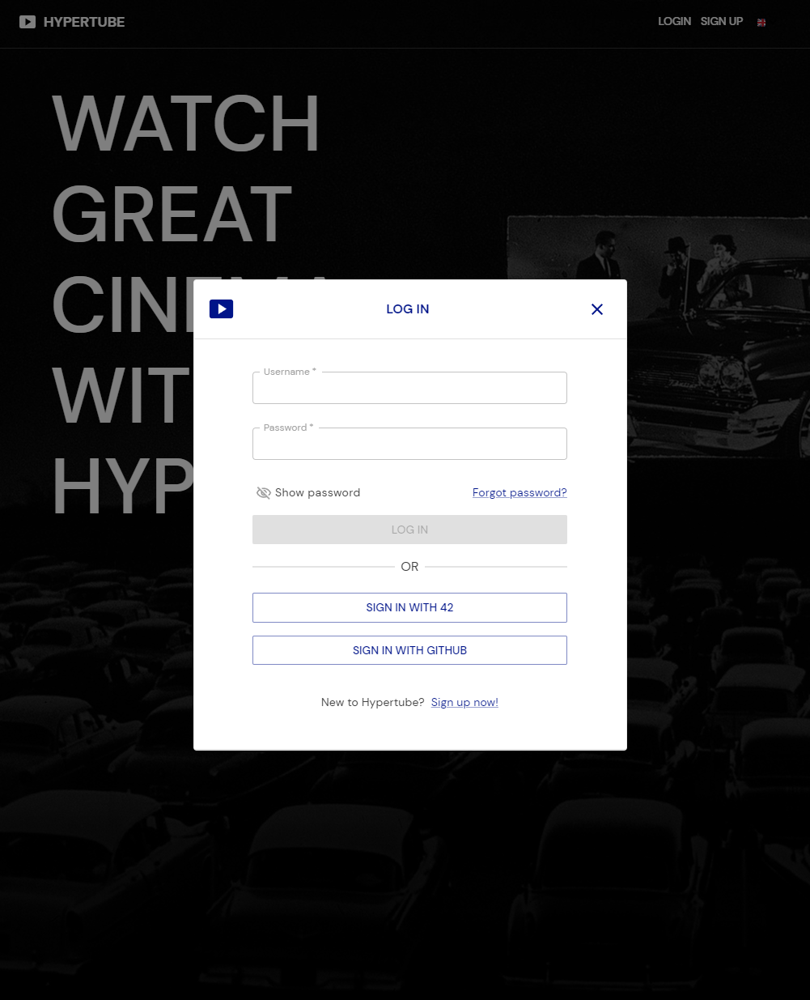
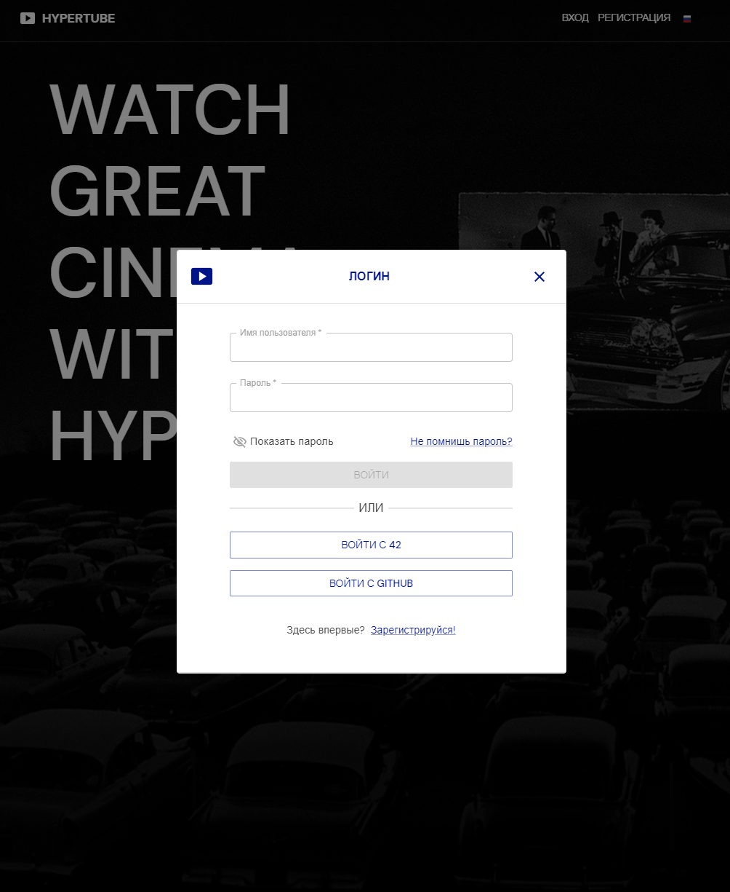
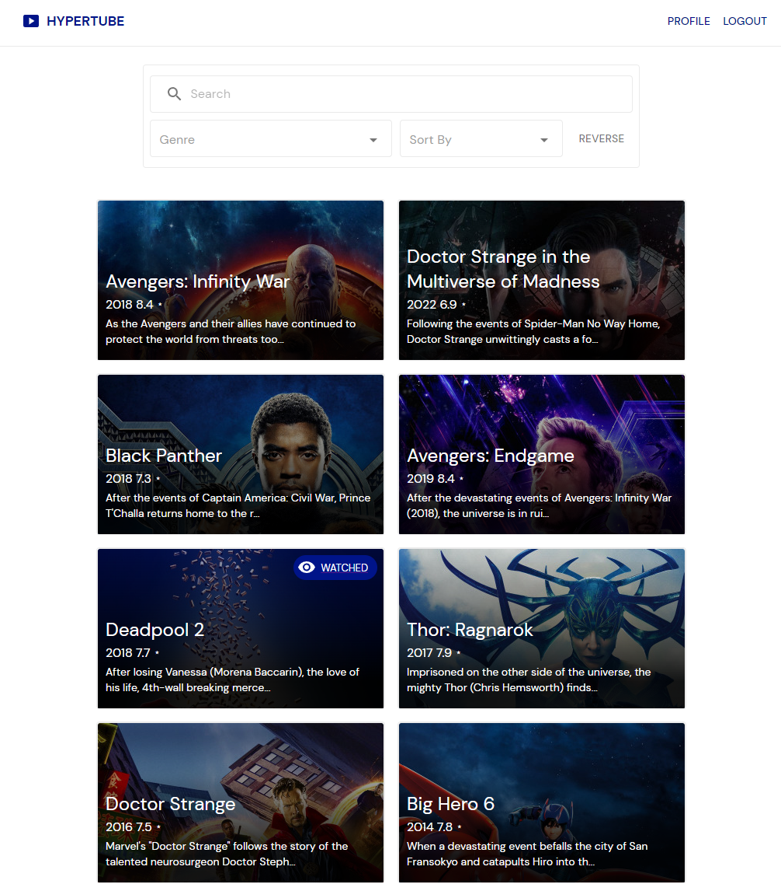
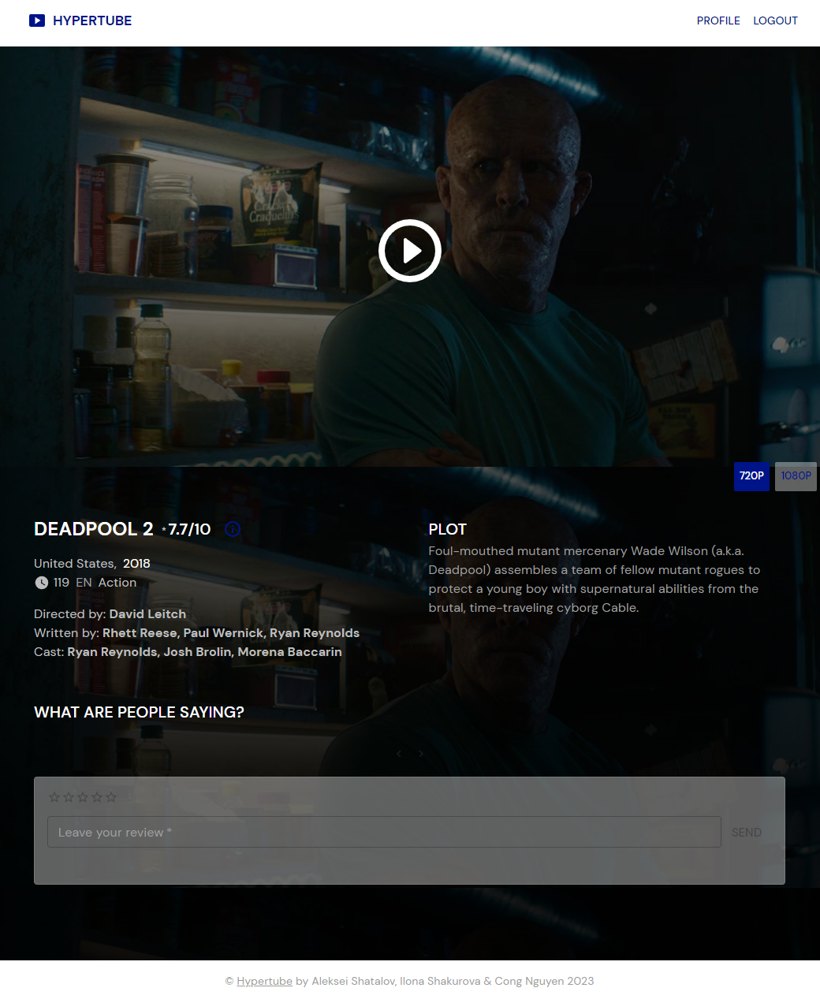

# Hypertube
Streaming Web application done with [Alexei](https://github.com/alex2011576) and [Ilona](https://github.com/fglsn) that allows the user to search, watch, comment videos. The player will be directly integrated to the site, and the videos will be downloaded through the BitTorrent protocol. 

## Stack
```console
* Typescript
* React
* Node.js
* Express.js
* PostgreSQL
* Mui
* Docker
```

## Login

## Localization

## Landing

## Movie

## Profile


# NOTE
THIS APPLICATION IS THE RESULT OF A SCHOOL PROJECT. IT'S PURPOSE WAS TO TEACH US ABOUT FILE STREAMING AND THE BIT TORRENT PROTOCOL. IT WAS NEVER MEANT TO RUN IN PRODUCTION AND WILL NEVER BE.
